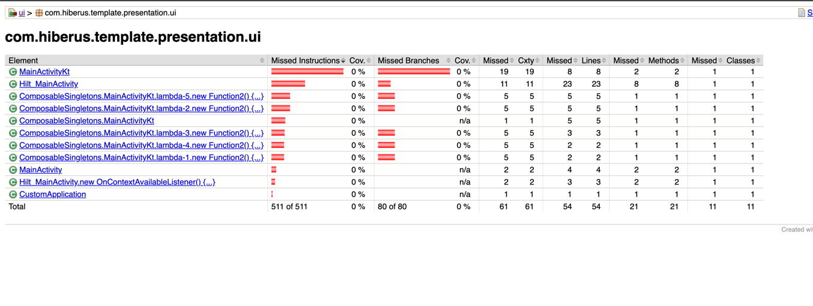

# Hiberus MVVM Clean Architecture Template

Esta nueva plantilla desarrollada para y por el área de desarrollo móvil de Hiberus
está orientada a facilitar el despliegue de proyectos de forma rápida y eficaz.

Implementa las últimas tecnologías propuestas por Google para la correcta implementación
y despliegue de proyectos a cualquier nivel de escala (si bien para proyectos sencillos
quizá sea un poco compleja y tenga sobreingeniería).

Entre las tecnologías implementadas e inicializadas en este proyecto, destacan por
su importancia las siguientes:

- **Inyección de dependencias**, con Dagger-Hilt que es el estándar de facto propuesto 
por Google.
- **Comunicaciones con servicios REST**, con Retrofit, el cual a día de hoy es el 
estándar de facto, aunque no está de más conocer la existencia de Ktor Client.
- **Motor ORM (Object Relational Mapping)**, con Room,el ORM por antonomasia en 
Android. Para Room se ha dejado un ejemplo y el proceso de migración configurado
  (con migraciones manuales, eso sí).
- **Interfaces de UI reactivas**, con el framework Jetpack Compose, la nueva forma 
de diseño e implementación de UI propuesta por Google.
- **Diseño Clean Architecture modular**, se ha implementado un diseño Clean Architecture
propio, en el que cada capa MVVM está completamente separada de todas aquellas que no
deben tener visibilidad sobre ella.
- **Análisis estático de código con detekt**, se ha desplegado un análisis estático de 
código mediante detekt que nos va a permitir mantener la coherencia con el código, impidiendo
de este modo que subamos código que no cumpla unos estándares mínimos de calidad.

## Descripción de la Arquitectura 

Como hemos comentado, este proyecto está basado en arquitectura Clean Architecture, 
pero con una particularidad que lo hace "diferente"... Dicha particularidad consiste 
en que las clásicas capas descritas están a su vez segmentadas en subproyectos,
con los que garantizamos, aparte de la escalabilidad, la protección de accesos entre
capas / áreas que no deben ser accesibles entre sí.

Veamos en primer lugar un esquema que representa esta nueva arquitectura:


Con el esquema en mente, describiremos qué estamos viendo, ya que se aleja (sólo
un poco) del concepto de Arquitectura Clean que hemos visto por internet,
revisemoslo por capas:

- **presentation**, define la capa de interacción con el usuario. Alberga dós módulos:
  - *ui*, en este módulo definiremos todas las interfaces de usuario que requiera la feature, ya sean
    composables o vistas clásicas, tiene como dependencia directa a la capa de viewmodels y los modelos
    de dominio.
  - *viewmodels*, en este módulo albergamos los viewmodels que nuestra feature requiera. Tiene como
    únicas dependencias la capa de casos de uso de domain y los modelos de dominio.
- **domain**, define la capa de dominio, en la que definiremos la lógica de negocio, casos de uso,
  interfaces de repositorios, modelos de datos, etc. Alberga los siguientes módulos:
  - *usecase*, en este módulo implementaremos *todos los casos de uso* que requiramos en nuestra
    feature. Como dependencias, tiene a repository y models (interfaces de repositorio y modelos de
    dominio).
  - *repository*, este módulo define las distintas interfaces de repositorio que la feature requiera.
    Este módulo tiene como única dependencia a models, esto es, los modelos de dominio.
  - *models*, se definen los modelos de dominio, que serán utilizados tanto por el resto de módulos de
    domain, presentation y las implementaciones de repositorios en data.
- **data**, se define la capa de acceso a datos. En esta capa se deben definir **todos los posibles
  orígenes de datos que puedan proporcionar información a la feature**, por ejemplo, esta capa debe ser
  la responsable de la obtención de datos de bases de datos, servicios rest, dispositivos bluetooth,
  gps, etc. Alberga los siguientes módulos (esta capa es la más compleja con diferencia):
  - *repository*, en esta capa implementaremos los distintos repositorios definidos en la capa de dominio,
    utilizando para ello las referencias obtenidas a partir de la capa gateway, por tanto, esta capa
    tendrá acceso a:
    - domain->repository
    - domain->models
    - data->models
    - data->datasources
  - *datasources*, en esta capa (similar en funcionalidad a domain->repository), definimos las interfaces
    que nos van a permitir la obtención de datos de los distintos orígenes de datos que soporte nuestra
    app.
  - *datasources-core*, se implementan las interfaces definidas en datasources, obteniendo datos de cualquier
    origen de datos posible (base de datos local, servicios rest, bluetooth, gps, etc).
  - *models*, en esta capa definimos los distintos modelos de datos de la feature, organizados en base
    a su posible origen / destino (local, remote, bluetooth, etc).
- **core**, esta capa, transversal, contiene una serie de módulos que, serán transversales a 
todo el proyecto, salvo capas específicas, que serán visibles únicamente por los módulos que
corresponda. Esta capa se dividirá en los siguientes módulos (como poco):
  - **di**, esta capa no tiene código, sólo agrega dependencias de **todos los módulos con elementos inyectables**
  a fin de que al agregarla como dependencia a **presentation:ui** el árbol de dependencias de Hilt se genere correctamente.
  - **ui**, contendrá elementos transversales a la capa de UI, los cuales **únicamente serán
  visibles por el módulo presentation->ui**. En este módulo definiremos la configuración de tema para 
  compose, así como un posible catálogo de composables de utilidad general para todo el proyecto
    (por ejemplo, composables como RadioGroup - implementado - y cualquier composable que deba tener
  una apariencia definida por UI/UX).
  - **common**, este módulo contiene constantes y / o funciones de extensión o cualquier otro elemento
  que sean de utilidad general **para todo el proyecto**, por lo que esta capa será visible por todo
  aquel módulo que sea susceptible de implementar lógica (no tiene sentido, en principio dar dependencia 
  de este módulo a módulos de modelos de datos o módulos puente con sólo contenido de interfaces).

## Funcionalidades implementadas

Como hemos comentado en la introducción, en esta plantilla se proporcionan una serie de elementos previamente
implementados / preconfigurados, a fin de que el arranque de proyecto sea lo más rápido posible, no teniendo
que invertir tiempo en tareas repetitivas de configuración.

### Inyección de dependencias

La inyección de dependencias la realizamos con Dagger-Hilt, el sistema recomendado por google, el cual permite
generar un árbol completo de dependencia sin la necesidad de definir todos los factory, al contrario de lo que 
sucede con, por ejemplo, Koin.

En cada módulo que implementa código (presentation-ui, presentation-viewmodels, domain-usecase,
data-repository, data-datasources-core) se definirá a nivel de raíz del módulo un package 
denominado **di**, en el que definiremos los objetos que definirán los providers o binders que 
Dagger-Hilt sea incapaz de generar de forma automática.

Así pues, por ejemplo, en la capa de data-datasources-core, se define un módulo de inyección en el que 
nos deja preparada la inyección (de tipo singleton) de retrofit, room y la gestión de preferencias
con Jetpack DataStore.

En capas superiores se muestra un ejemplo de cómo inyectar precisamente la gestión de preferencias.

Como nota final, una gran ventaja de Dagger-Hilt, es que si el proyecto compila correctamente,
entonces eso indica que hemos realizado una correcta configuración del árbol de dependencias que Dagger-Hilt requiere.

### Room (ORM)

Room queda totalmente preparado en la capa de datasources-core (no sale de dicha capa y no se conoce 
su existencia fuera de dicha capa). Así mismo, en la capa de datasources-models se define un ejemplo
de entidad para Room (CacheExampleEntity), cuyo uso es simplemente para permitir la generación del código 
necesario para que Room se despliegue.

Además hemos dejado a Room preparado para la gestión automática y manual de dependencias, permitiendo
que todo quede perfectamente enlazado, requiriendo a futuro con respecto a las modificaciones de base 
de datos (migraciones), que el trabajo a realizar sea mínimo.

### Retrofit

Al igual que sucede con Room se deja la plantilla preparada para que en la capa de datasources-core tengamos
todo listo para que el despliegue de retrofit sea trivial, ya que tan solo vamos a tener que agregar endpoints 
a la interfaz que define a retrofit, y quizá (aunque están implementados de forma básica) interceptores que nos 
van a permitir gestionar de forma rápida y sencilla los procesos de autenticación.

### Domain - UseCase (Casos de Uso)

Por norma, un caso de uso debería implementar una única funcionalidad de un repositorio, por lo tanto,
para simplificar dicho caso de uso y a la hora de utilizarlo escribir menos código, definiremos nuestros
casos de uso como sigue:

```kotlin
class MyUseCase @Inject constructor(
    private val myRepository: MyRepository
) {
    operator fun invoke(parameter: P): T {
        val tValue: T = myRepository.someFunctionThatReturnsT()
        // do something with tValue...
      
        return tValue
    }
}
```

donde P es un tipo de entrada a la función invoke y T sería un tipo de retorno, evidentemente T puede 
ser cualquier tipo de dato (incluido, por ejemplo, un Flow).

El utilizar invoke con esta firma nos permite realizar lo siguiente:

```kotlin
@HiltViewModel
class MyViewModel @Inject constructor(
    private val useCase: MyUseCase
): ViewModel() {
    init {
        val pValue: P = P()
        useCase(pValue)
    }
}
```

### Presentation - ViewModels

En esta capa no hay mucho que contar, se definen los viewmodels anotándolos como @HiltViewModel, ya que
es requisito indispensable de Hilt para su correcto funcionamiento. Podemos ver un ejemplo básico en el 
punto anterior.

### Presentation - UI

En esta capa tenemos todo lo necesario para la ejecución de la app, y será la responsable de la implementación
de las distintas Screens que nuestra app implementará. Además como curiosidad, esta plantilla está diseñada para 
implementar las distintas UI utilizando JetpackCompose, para lo cual además se apoyará en el módulo de 
Core-UI, en el cual, como veremos a continuación se van a definir diversos elementos que van a permitirnos
centralizar ciertos aspectos del desarrollo de nuestras UI. En cuanto al uso de compose, se recomienda el uso
del [Curso desarrollado por el área de mobile de Hiberus para Jetpack Compose](https://hiberus.sharepoint.com/sites/HiberusJetPackComposeLearning),
el cual nos va a permitir adquirir (en caso de no tenerlos ya) de los conocimientos básicos para el diseño y desarrollo
de UI con este nuevo framework reactivo (en caso de no tener acceso, pedirlo a cualquiera de los TL del área).

A tener en cuenta, en esta capa NO se define el tema de la app, el tema viene impuesto desde Core-UI,
así como diversas funcionalidades asociados al tema, lo que nos permitirá por ejemplo gestionar de forma muy
sencilla un cambio de tema en función de buildvariant, ya que tan solo deberemos sobreescribir ciertos elementos
teniendo todo centralizado.

### Core - Common

En esta capa **transversal a todo el proyecto ** se incluyen diversas funciones de extensión, infix, etc que nos van
a facilitar en mayor o menor grado el uso de ciertas funcionalidades, a fin de que no tengamos que implementar de forma
continuada las mismas funcionalidades.

### Core - UI

Esta es la capa que, siendo sólo visible por presentation-ui, nos va a permitir definir los aspectos principales
de todo el proyecto. En concreto, definiremos tanto el tema que afectará a toda la UI de la app, así como elementos 
generales que nos van a permitir desarrollar ciertas funcionalidades que, de otro modo, resultarían bastante complejas.
Entre dichas funcionalidades destacan:
- **ViewModelService**, se trata de una reimplementación de los servicios Android, pero dotándolos de acceso a los 
ViewModel, con lo que podremos crear servicios en foreground totalmente reactivos a cambios. De este modo, no requeriremos
de Workmanagers ni otra herramienta que ejecute comprobaciones en segundo plano.
- **NetworkingStatusTracker**, esta clase nos permitirá conocer en todo momento, utilizando Flow el estado de conectividad
del dispositivo (requiere de la aceptación de diversos permisos).
- **AuthManager**, esta suite de utilidades nos permite almacenar credenciales de usuario en el sistema de cuentas de Android,
dotando a nuestra app no sólo de una capa extra de seguridad, sino que además le da una apariencia más profesional, ya que las 
cuentas se gestionan como, por ejemplo, las cuentas Google, WhatsApp, etc.
- **Utilidades Jetpack Compose**, se han agregado (como ejemplo) diversas utilidades que nos facilitarán el trabajo, aunque es
responsabilidad del desarrollador agregar aquí **todos aquellos componentes que sean de uso general en la app**, de este modo,
se evita duplicar código de forma innecesaria. Entre los elementos Composables agregados, destacan:
  - *RadioGroup*, es como su nombre indica una agrupación de RadioButtons, facilita el proceso de agrupación, tan solo hay que
  proporcionarle una lista de elementos entre los que elegir, y definir cómo queremos pintar cada RadioButton (esto en su forma 
  básica, de forma avanzada permite bastantes funcionalidades).
  - **LocalBiometricCapabilities**, es una extensión a las LocalComposition de compose que nos permite centralizar todo el proceso
  de autenticación biométrica, facilitando y minimizando la implementación.
  - **LocalNetworkStatus**, nos permite, utilizando LocalComposition, acceder al estado de la red desde cualquier elemento Componible.
  - **setUiContent**, con este método sustituiremos el setContent con el que inicializamos las UI de compose, gracias a esta sustitución
  los elementos de LocalComposition descritos en los puntos anteriores, se inicializan de forma automática.
  - **AppTheme**, se sobreescribe el tema por defecto, dotándolo de más funcionalidad, se agrega a las propiedades por defecto que expone
  MaterialTheme otra propiedad (podría ser extensible) de desarrollo propio llamada **dimens** en la que, en un objeto de tipo
  **MobileDimens** definimos las distintas dimensiones, paddings, etc que nuestra app debe tener (esto está enfocado a que definamos nuestros
  componentes base en esta capa).

## Herramientas extra

Como no todo es codificar, se han agregado a este proyecto una serie de herramientas que van a permitirnos mantener una calidad de código
estandarizada, así como garantizar una buena cobertura de tests en el caso de requerir esa característica. Para ello, se han desplegado
un par de plugins a nivel de proyecto que nos van a facilitar esta tarea:

- **detekt**, es el analizador de código estático por antonomasia, gracias a este analizador de código mantener la limpieza y coherencia
de nuestro código va a resultar muy sencillo, **ya que nos obliga** a escribir nuestro código de una cierta manera, aplicando una serie
de reglas de escritura de código, provocando que el desarrollador deba mantener una calidad y pautas mínimas, garantizando así que todos 
los desarrolladores escriban su código del mismo modo. Para ejecutar detekt, tan solo deberemos ejecutar su tarea gradle asociada,
llamada "detekt", o bien por consola (en la raíz del proyecto), ejecutando el siguiente comando:
```bash
./gradlew detekt
```
- **JaCoCo** (Java Code Coverage), este plugin permite que, al ejecutarlo, realice un análisis de cobertura de código de los tests
  (unitarios, de integración, end to end) definidos y escritos en el proyecto. De este modo, si se nos llegase a exigir un mínimo de 
cobertura de testing, gracias a JaCoCo podríamos saber en qué nivel estamos y cumplir ese requisito.
Para ejecutar JaCoCo, al igual que con detekt tan sólo deberemos ejecutar su tarea gradle asociada, llamada
"jacocoTestReportDebug", bien desde consola (en la raíz del proyecto):
```bash
./gradlew jacocoTestReportDebug
```
JaCoCo, una vez finalizada la tarea, nos generará una carpeta de reporting con 
código HTML en el que podremos ver el nivel de cobertura de tests de nuestras clases.
En el caso de que tengamos buildVariants, favors, etc, jacoco nos generará una carpeta
de resultados para cada una de ellas, concretamente cada carpeta de reporting de
cobertura de JaCoCo se generará en la ruta: **[RootProjectPath]/[Clean Arch Layer]/[ModuleName]/build/reports/jacoco/jacocoTestReportDebug**.

El resultado de JaCoCo lo vemos en la siguiente captura de pantalla:



Como vemos, tendríamos una cobertura de test del 0%.


